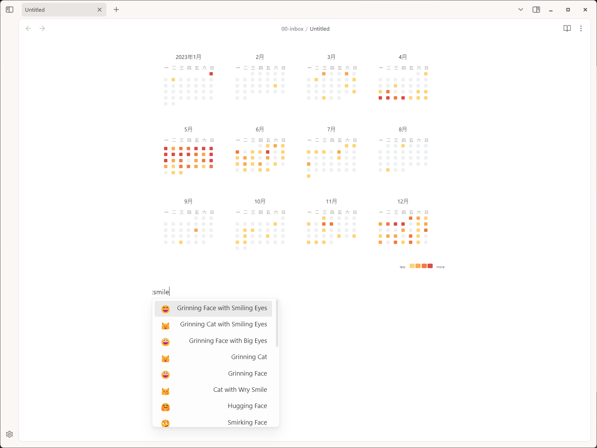
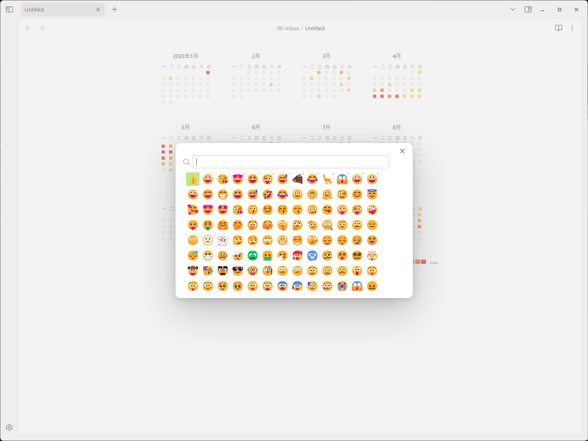
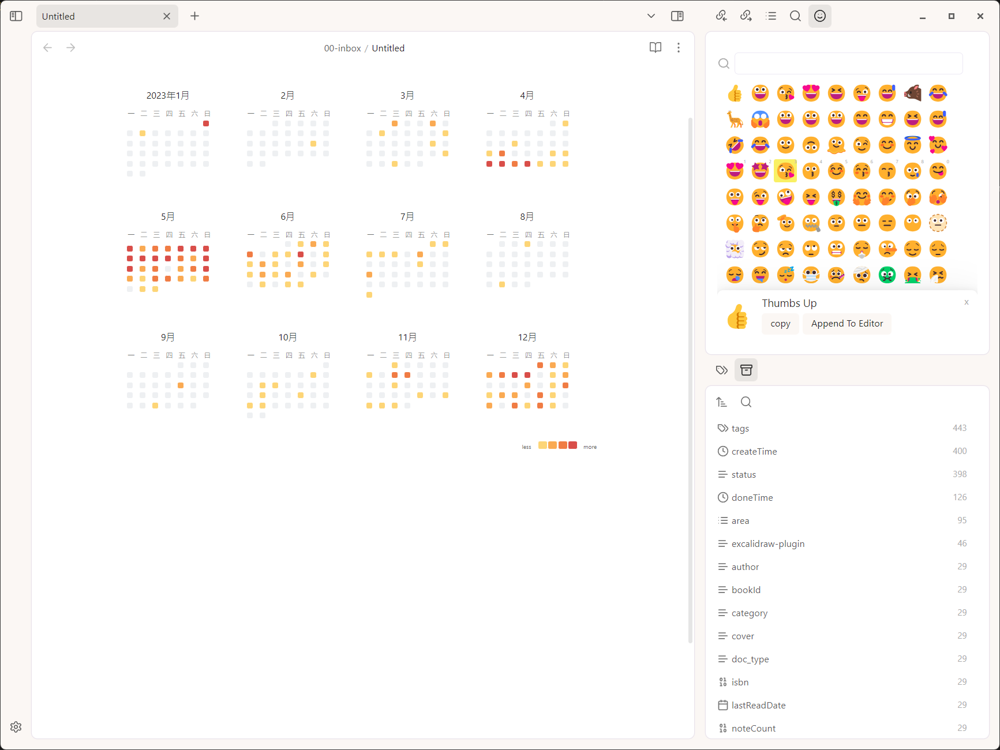

## What

just a dead simple and powerful [obsidian.md]([text](https://obsidian.md/)) plugin to add emoji to your note

## How to use

There are 3 ways

- write `:`, then you will see emoji suggest panel, type some word to filter emojis.

- press `ctrl+p` (or `command+p` on mac), select `open emojio modal`

- press `ctrl+p` (or `command+p` on mac), select `open emojio view` 

## My another Plugins

- [Contribution Graph, The best heatmap graph plugin for obsidian](https://github.com/vran-dev/obsidian-contribution-graph)